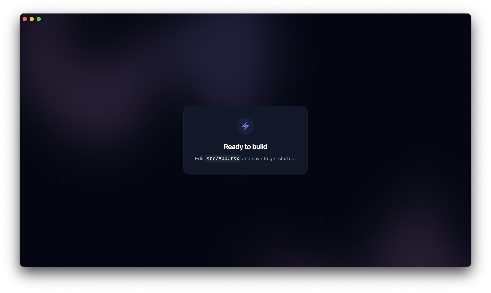

# Electron + React Template

A minimal starting point for building cross-platform desktop
applications with Electron and a modern React frontend. Clone it, install, and
start shipping — the boilerplate, tooling, and dark-themed window chrome are
already wired up.



## Tech Stack

| Layer        | Technology                          |
| ------------ | ----------------------------------- |
| Desktop      | [Electron](https://www.electronjs.org/) |
| UI           | [React 19](https://react.dev/)      |
| Build tool   | [Vite](https://vite.dev/)           |
| Language     | [TypeScript](https://www.typescriptlang.org/) (SWC) |
| Styling      | [Tailwind CSS](https://tailwindcss.com/) |
| Components   | [Headless UI](https://headlessui.com/) · [Heroicons](https://heroicons.com/) |

## Getting Started

Clone the repository:

```bash
git clone https://github.com/asinghka/electron-react-template.git
cd electron-react-template
```

Install dependencies:

```bash
npm install
```

Run the app in development (Vite dev server + Electron with hot reload):

```bash
npm start
```

## Scripts

| Command           | Description                                            |
| ----------------- | ------------------------------------------------------ |
| `npm start`       | Launch the Vite dev server and Electron concurrently   |
| `npm run dev`     | Start only the Vite dev server                          |
| `npm run build`   | Type-check and build the production frontend bundle     |
| `npm run preview` | Preview the production build                            |
| `npm run lint`    | Run ESLint across the project                           |

## Project Structure

```
electron/        Electron main & preload processes
src/             React application source
  App.tsx        Root component
  main.tsx       React entry point
index.html       Vite HTML entry
```

The Electron main process (`electron/main.js`) loads the Vite dev server in
development and the built `dist/` bundle in production, with automatic reconnect
while the dev server starts up.
